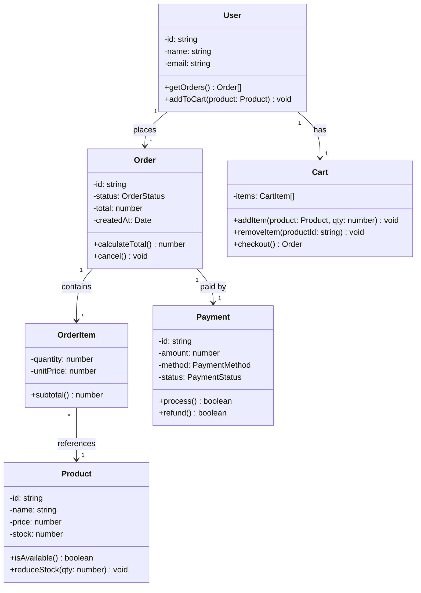
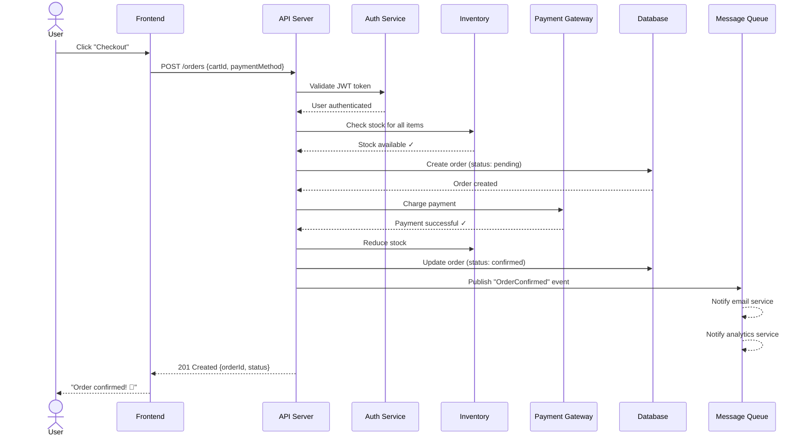
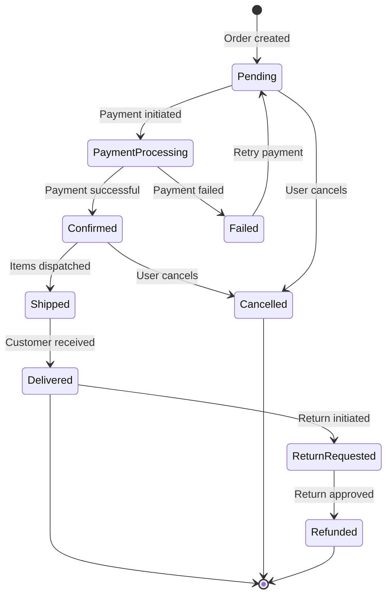

# API Design & UML Diagrams

## RESTful API Design

### REST Principles

| Principle | Meaning |
|---|---|
| **Stateless** | Each request contains all info needed; server stores no client state |
| **Resource-based** | URLs represent nouns (resources), not verbs (actions) |
| **Uniform Interface** | Standard HTTP methods, consistent URL patterns |
| **HATEOAS** | Responses include links to related resources |

### URL Design

```
# ✅ Good — resource-oriented nouns, plural
GET    /api/v1/users          — List users
GET    /api/v1/users/123      — Get user 123
POST   /api/v1/users          — Create user
PUT    /api/v1/users/123      — Replace user 123
PATCH  /api/v1/users/123      — Partial update user 123
DELETE /api/v1/users/123      — Delete user 123

# Nested resources
GET    /api/v1/users/123/orders       — User 123's orders
GET    /api/v1/users/123/orders/456   — Specific order

# ❌ Bad — verbs in URLs, inconsistent
GET    /api/getUser?id=123
POST   /api/createNewUser
GET    /api/user/delete/123
```

### HTTP Status Codes

| Code | Meaning | When to Use |
|---|---|---|
| 200 | OK | Successful GET, PUT, PATCH |
| 201 | Created | Successful POST (resource created) |
| 204 | No Content | Successful DELETE |
| 400 | Bad Request | Validation error, malformed input |
| 401 | Unauthorized | Missing/invalid authentication |
| 403 | Forbidden | Authenticated but not authorized |
| 404 | Not Found | Resource doesn't exist |
| 409 | Conflict | Duplicate resource, version conflict |
| 422 | Unprocessable Entity | Valid syntax but semantic errors |
| 429 | Too Many Requests | Rate limited |
| 500 | Internal Server Error | Server bug |
| 503 | Service Unavailable | Server overloaded/maintenance |

### Request/Response Design

```typescript
// POST /api/v1/users
// Request
{
  "name": "Alice Chen",
  "email": "alice@example.com",
  "role": "admin"
}

// Response (201 Created)
{
  "data": {
    "id": "usr_abc123",
    "name": "Alice Chen",
    "email": "alice@example.com",
    "role": "admin",
    "createdAt": "2024-01-15T10:30:00Z"
  },
  "links": {
    "self": "/api/v1/users/usr_abc123",
    "orders": "/api/v1/users/usr_abc123/orders"
  }
}

// Error Response (400)
{
  "error": {
    "code": "VALIDATION_ERROR",
    "message": "Request validation failed",
    "details": [
      { "field": "email", "message": "Invalid email format" },
      { "field": "name", "message": "Name is required" }
    ]
  }
}
```

### Pagination

```typescript
// Offset-based (simple, common)
GET /api/v1/users?page=2&limit=20

{
  "data": [...],
  "pagination": {
    "page": 2,
    "limit": 20,
    "total": 150,
    "totalPages": 8
  }
}

// Cursor-based (better for large datasets, real-time)
GET /api/v1/users?cursor=eyJpZCI6MTAwfQ&limit=20

{
  "data": [...],
  "pagination": {
    "nextCursor": "eyJpZCI6MTIwfQ",
    "hasMore": true
  }
}
```

### API Versioning Strategies

| Strategy | Example | Pros | Cons |
|---|---|---|---|
| URL path | `/api/v1/users` | Simple, explicit | URL bloat |
| Query param | `/api/users?version=1` | Easy to default | Easy to forget |
| Header | `Accept: application/vnd.api.v1+json` | Clean URLs | Less visible |
| Content negotiation | `Accept: application/json; version=1` | Standards-based | Complex |

**Recommendation:** URL path versioning (`/v1/`) — most explicit and widely understood.

---

## UML Diagrams

### Class Diagram — E-Commerce Domain



### Sequence Diagram — Checkout Flow



### State Diagram — Order Lifecycle



## API Design Checklist

- [ ] Resources are nouns, not verbs
- [ ] Consistent naming convention (camelCase or snake_case, never mixed)
- [ ] Proper HTTP status codes
- [ ] Pagination for list endpoints
- [ ] Rate limiting with `429` and `Retry-After` header
- [ ] Versioning strategy decided
- [ ] Error responses are structured and consistent
- [ ] Authentication/authorization on all endpoints
- [ ] Input validation and sanitization
- [ ] CORS configured for web clients
- [ ] Request/response logging for debugging
- [ ] API documentation (OpenAPI/Swagger)
