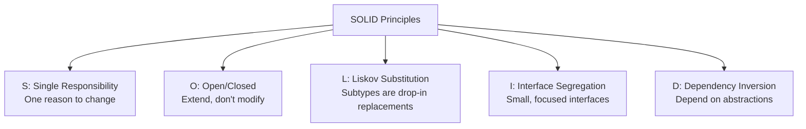

# SOLID Principles & DRY

## SOLID — The Five Pillars of OO Design

### S — Single Responsibility Principle (SRP)

> A class should have only one reason to change.

```typescript
// ❌ VIOLATION: UserService does too many things
class UserService {
  createUser(data: UserData) { /* ... */ }
  sendWelcomeEmail(user: User) { /* ... */ }     // email concern
  generateReport(users: User[]) { /* ... */ }     // reporting concern
  validatePassword(password: string) { /* ... */ } // validation concern
}

// ✅ GOOD: Each class has one responsibility
class UserRepository {
  create(data: UserData): User { /* ... */ }
  findById(id: string): User | null { /* ... */ }
}

class EmailService {
  sendWelcomeEmail(user: User): void { /* ... */ }
}

class PasswordValidator {
  validate(password: string): ValidationResult { /* ... */ }
}

class UserReportGenerator {
  generate(users: User[]): Report { /* ... */ }
}
```

**Heuristic:** If you can't describe your class without using "and," it does too much.

---

### O — Open/Closed Principle (OCP)

> Software entities should be open for extension but closed for modification.

```typescript
// ❌ VIOLATION: Must modify existing code for each new payment method
class PaymentProcessor {
  process(method: string, amount: number) {
    if (method === "credit") { /* ... */ }
    else if (method === "paypal") { /* ... */ }
    else if (method === "crypto") { /* ... */ } // keeps growing!
  }
}

// ✅ GOOD: Extend via new implementations, never modify processor
interface PaymentMethod {
  name: string;
  charge(amount: number): Promise<Receipt>;
}

class CreditCardPayment implements PaymentMethod {
  name = "credit";
  async charge(amount: number) { /* stripe API */ }
}

class PayPalPayment implements PaymentMethod {
  name = "paypal";
  async charge(amount: number) { /* paypal API */ }
}

// New payment? Just add a new class — no existing code changes
class CryptoPayment implements PaymentMethod {
  name = "crypto";
  async charge(amount: number) { /* blockchain API */ }
}

class PaymentProcessor {
  async process(method: PaymentMethod, amount: number): Promise<Receipt> {
    return method.charge(amount);
  }
}
```

---

### L — Liskov Substitution Principle (LSP)

> Subtypes must be substitutable for their base types without altering program correctness.

```typescript
// ❌ VIOLATION: Square changes expected Rectangle behavior
class Rectangle {
  constructor(protected width: number, protected height: number) {}

  setWidth(w: number) { this.width = w; }
  setHeight(h: number) { this.height = h; }
  area(): number { return this.width * this.height; }
}

class Square extends Rectangle {
  setWidth(w: number) { this.width = w; this.height = w; }  // breaks expectation!
  setHeight(h: number) { this.width = h; this.height = h; }
}

function doubleWidth(rect: Rectangle) {
  const originalHeight = rect.area() / 10; // assume width=10
  rect.setWidth(20);
  // For Rectangle: area = 20 * height ✅
  // For Square: area = 20 * 20 = 400 ❌ (height changed!)
}

// ✅ FIX: Use composition or separate interfaces
interface Shape {
  area(): number;
}
class Rectangle implements Shape { /* ... */ }
class Square implements Shape { /* ... */ }
```

**Test:** Can you replace a parent with any child in all scenarios without surprises? If not, LSP is violated.

---

### I — Interface Segregation Principle (ISP)

> Clients should not be forced to depend on interfaces they don't use.

```typescript
// ❌ VIOLATION: Printer forced to implement scan and fax
interface MultiFunctionDevice {
  print(doc: Document): void;
  scan(doc: Document): void;
  fax(doc: Document): void;
}

class BasicPrinter implements MultiFunctionDevice {
  print(doc: Document) { /* works */ }
  scan(doc: Document) { throw new Error("Not supported"); } // forced stub!
  fax(doc: Document) { throw new Error("Not supported"); }
}

// ✅ GOOD: Segregated interfaces
interface Printable { print(doc: Document): void; }
interface Scannable { scan(doc: Document): void; }
interface Faxable { fax(doc: Document): void; }

class BasicPrinter implements Printable {
  print(doc: Document) { /* works */ }
}

class AllInOnePrinter implements Printable, Scannable, Faxable {
  print(doc: Document) { /* ... */ }
  scan(doc: Document) { /* ... */ }
  fax(doc: Document) { /* ... */ }
}
```

---

### D — Dependency Inversion Principle (DIP)

> High-level modules should not depend on low-level modules. Both should depend on abstractions.

```typescript
// ❌ VIOLATION: High-level module depends on concrete implementation
class OrderService {
  private db = new MySQLDatabase(); // tightly coupled!
  private mailer = new SendGridMailer(); // tightly coupled!

  createOrder(data: OrderData) {
    this.db.insert("orders", data);
    this.mailer.send(data.email, "Order confirmed");
  }
}

// ✅ GOOD: Depend on abstractions, inject implementations
interface Database {
  insert(table: string, data: Record<string, unknown>): Promise<void>;
}

interface Mailer {
  send(to: string, body: string): Promise<void>;
}

class OrderService {
  constructor(
    private db: Database,     // depends on interface
    private mailer: Mailer    // depends on interface
  ) {}

  async createOrder(data: OrderData) {
    await this.db.insert("orders", data);
    await this.mailer.send(data.email, "Order confirmed");
  }
}

// Easy to test with mocks, easy to swap implementations
const service = new OrderService(new PostgresDB(), new SESMailer());
```

---

## DRY — Don't Repeat Yourself

> Every piece of knowledge must have a single, unambiguous, authoritative representation within a system.

### DRY Done Right

```typescript
// ❌ WET (Write Everything Twice)
function validateCreateUser(data: CreateUserDTO) {
  if (!data.email || !data.email.includes("@")) throw new Error("Invalid email");
  if (!data.name || data.name.length < 2) throw new Error("Name too short");
}

function validateUpdateUser(data: UpdateUserDTO) {
  if (data.email && !data.email.includes("@")) throw new Error("Invalid email");
  if (data.name && data.name.length < 2) throw new Error("Name too short");
}

// ✅ DRY: Single source of validation rules
const validationRules = {
  email: (val: string) => val.includes("@") || "Invalid email",
  name: (val: string) => val.length >= 2 || "Name too short",
};

function validate(data: Record<string, string>, rules: typeof validationRules, partial = false) {
  for (const [field, rule] of Object.entries(rules)) {
    if (partial && !(field in data)) continue;
    const result = rule(data[field]);
    if (result !== true) throw new Error(result);
  }
}
```

### DRY Anti-Pattern: Wrong Abstraction

> Duplication is far cheaper than the wrong abstraction. — Sandi Metz

Don't prematurely abstract just because two pieces of code look similar. They may evolve differently.

**Rule of Three:** Wait until you see the pattern three times before extracting a shared abstraction.

## SOLID Summary


