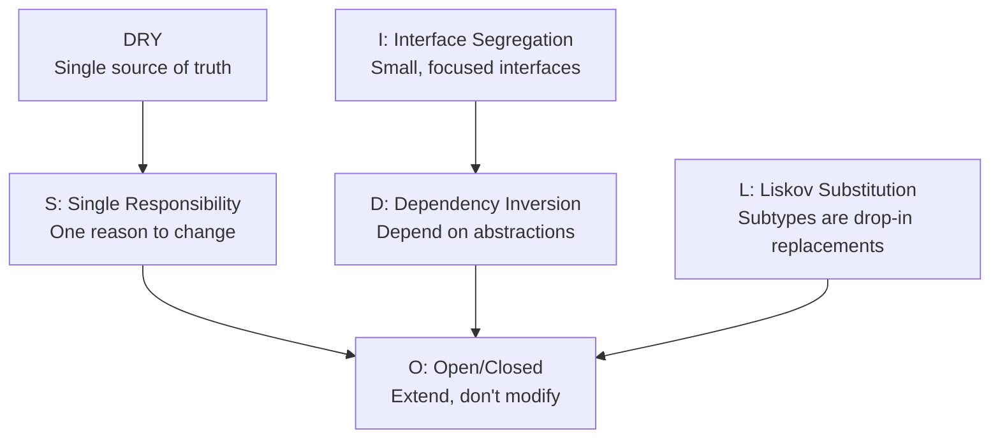

# SOLID Principles & DRY

SOLID is a set of five design principles that, when followed together, produce code that is modular, testable, and resilient to change. Coined by Robert C. Martin (Uncle Bob), they are the foundation of clean object-oriented and functional design.

> The goal isn't to follow rules for their own sake. The goal is code that is easy to **understand**, **change**, and **test** — principles are the means.

---

## Why SOLID Matters

Bad code isn't bad because the author was careless — it's bad because it accumulates **coupling** and **rigidity** over time. Each of the SOLID principles targets one specific way code becomes harder to change:

| Principle | Problem It Solves |
|---|---|
| **S** — Single Responsibility | Classes/modules that change for too many reasons |
| **O** — Open/Closed | Code that must be modified to add new behaviour |
| **L** — Liskov Substitution | Inheritance that breaks expected behaviour |
| **I** — Interface Segregation | Fat interfaces that force unnecessary dependencies |
| **D** — Dependency Inversion | Tight coupling between high-level and low-level code |

---

## S — Single Responsibility Principle

> **A class should have only one reason to change.**

"Reason to change" means **stakeholder** or **axis of change**. If marketing changes email copy AND the database team changes your schema AND the reporting team changes output formats — and all of those changes hit the *same class* — that class has too many responsibilities.

### Violation

```typescript
class UserService {
  async registerUser(data: RegisterDTO) {
    // 1. Validation logic
    if (!data.email.includes('@')) throw new Error('Invalid email');
    if (data.password.length < 8) throw new Error('Password too short');

    // 2. Database logic
    const hashedPw = await bcrypt.hash(data.password, 12);
    const user = await db.query(
      'INSERT INTO users (email, password_hash) VALUES ($1, $2) RETURNING *',
      [data.email, hashedPw]
    );

    // 3. Email logic
    await nodemailer.createTransport({ /* ... */ }).sendMail({
      to: data.email,
      subject: 'Welcome!',
      html: `<h1>Hi ${data.email}</h1>...`
    });

    // 4. Analytics logic
    await mixpanel.track('user.registered', { userId: user.id });

    return user;
  }
}
```

This class changes when:
- Validation rules change
- Database schema changes
- Email template changes
- Analytics provider changes

That's four separate reasons to change = four violations.

### Fixed

```typescript
// Each class has exactly ONE reason to change

class UserValidator {
  validate(data: RegisterDTO): void {
    if (!data.email.includes('@')) throw new ValidationError('Invalid email');
    if (data.password.length < 8) throw new ValidationError('Password too short');
  }
}

class UserRepository {
  async create(email: string, passwordHash: string): Promise<User> {
    return db.query(
      'INSERT INTO users (email, password_hash) VALUES ($1, $2) RETURNING *',
      [email, passwordHash]
    );
  }
}

class EmailService {
  async sendWelcome(user: User): Promise<void> {
    await this.transport.sendMail({
      to: user.email,
      subject: 'Welcome!',
      html: templates.welcome(user),
    });
  }
}

class AnalyticsService {
  trackRegistration(userId: number): void {
    mixpanel.track('user.registered', { userId });
  }
}

// The orchestrator — coordinates, doesn't implement
class UserRegistrationService {
  constructor(
    private validator: UserValidator,
    private users: UserRepository,
    private email: EmailService,
    private analytics: AnalyticsService,
  ) {}

  async register(data: RegisterDTO): Promise<User> {
    this.validator.validate(data);
    const hash = await bcrypt.hash(data.password, 12);
    const user = await this.users.create(data.email, hash);
    await this.email.sendWelcome(user);
    this.analytics.trackRegistration(user.id);
    return user;
  }
}
```

### Identifying SRP Violations

- If you can describe the class with "and" — it does too much
- If changing an email template requires touching a file that also has database code
- If your class has more than ~200 lines
- If testing one behaviour requires setting up unrelated infrastructure (mocking a mailer to test a validator)

---

## O — Open/Closed Principle

> **Software entities should be open for extension but closed for modification.**

You should be able to add new behaviour *without changing existing, tested code*. The mechanism is **abstraction** — depend on interfaces, not concrete classes. New behaviour = new implementation of the interface.

### Violation

```typescript
class ReportGenerator {
  generate(type: string, data: SalesData): string {
    if (type === 'pdf') {
      return this.generatePDF(data);
    } else if (type === 'csv') {
      return this.generateCSV(data);
    } else if (type === 'excel') {
      return this.generateExcel(data);
    }
    // Adding 'html' format? Must open this file and modify it.
    // Every modification risks breaking existing formats.
    throw new Error(`Unknown type: ${type}`);
  }
}
```

### Fixed — Strategy Pattern

```typescript
// Define the abstraction (the extension point)
interface ReportFormatter {
  format(data: SalesData): string;
  readonly mimeType: string;
}

// Existing implementations — NEVER need to change
class PDFFormatter implements ReportFormatter {
  readonly mimeType = 'application/pdf';
  format(data: SalesData): string { /* ... */ }
}

class CSVFormatter implements ReportFormatter {
  readonly mimeType = 'text/csv';
  format(data: SalesData): string { /* ... */ }
}

// ✅ Adding HTML format = adding a NEW class, zero modification of existing code
class HTMLFormatter implements ReportFormatter {
  readonly mimeType = 'text/html';
  format(data: SalesData): string { /* ... */ }
}

// The generator is now CLOSED for modification
class ReportGenerator {
  private formatters = new Map<string, ReportFormatter>();

  register(name: string, formatter: ReportFormatter): void {
    this.formatters.set(name, formatter);
  }

  generate(type: string, data: SalesData): string {
    const formatter = this.formatters.get(type);
    if (!formatter) throw new Error(`Unknown format: ${type}`);
    return formatter.format(data);
  }
}

// Wire up at startup
const generator = new ReportGenerator();
generator.register('pdf',   new PDFFormatter());
generator.register('csv',   new CSVFormatter());
generator.register('html',  new HTMLFormatter()); // extend, never modify
```

### Real-World OCP: Middleware Chains

Express/Fastify/Koa are built on OCP — you extend the pipeline by adding middleware, never by modifying the framework's core request handler.

```typescript
// Framework core: closed for modification
app.use(logger());          // extend
app.use(authenticate());    // extend
app.use(rateLimit());       // extend
app.use(cors());            // extend
// Each middleware is an extension point — no framework code changes
```

### When OCP Feels Overkill

OCP has a cost — it introduces abstractions and indirection. Apply it **where change is likely**:
- Payment processors (new providers are added frequently)
- Notification channels (email/SMS/push — always growing)
- Report formats, export types
- Authentication strategies

Don't pre-emptively apply it everywhere — wait until the *second* extension point appears.

---

## L — Liskov Substitution Principle

> **Subtypes must be substitutable for their base types without altering the correctness of the program.**

If `class Bird` and `class Penguin extends Bird` both exist, every piece of code that works with `Bird` must work equally correctly with a `Penguin` — no special cases, no surprises, no exceptions thrown where none were thrown before.

LSP is violated when a subclass:
- Throws exceptions the parent doesn't
- Weakens postconditions (returns less than promised)
- Strengthens preconditions (requires more than the parent)
- Changes the meaning of the base behaviour

### Classic Violation — Rectangle/Square

```typescript
class Rectangle {
  constructor(protected width: number, protected height: number) {}
  setWidth(w: number)  { this.width = w; }
  setHeight(h: number) { this.height = h; }
  area(): number { return this.width * this.height; }
}

class Square extends Rectangle {
  setWidth(w: number)  { this.width = w; this.height = w; } // ← breaks expectation!
  setHeight(h: number) { this.width = h; this.height = h; }
}

// Code that works correctly with Rectangle breaks with Square
function testRectangle(r: Rectangle) {
  r.setWidth(5);
  r.setHeight(10);
  console.log(r.area()); // expect 50
  // With Rectangle: 5 × 10 = 50 ✅
  // With Square: 10 × 10 = 100 ❌  (setWidth(5) also set height=5, then setHeight(10) set both=10)
}
```

### Real-World Violation — Silent Failure

```typescript
class FileStorage {
  save(key: string, data: Buffer): void {
    fs.writeFileSync(`/storage/${key}`, data);
  }

  load(key: string): Buffer {
    return fs.readFileSync(`/storage/${key}`);
  }
}

class ReadOnlyStorage extends FileStorage {
  save(key: string, data: Buffer): void {
    // Does nothing silently — or throws! Neither was in the contract.
    throw new Error('Read-only storage cannot save');
  }
}

// Any code passing ReadOnlyStorage where FileStorage is expected
// will either silently lose data or crash unexpectedly
function backup(storage: FileStorage, data: Buffer) {
  storage.save('backup', data); // 💥 throws if ReadOnlyStorage
}
```

### Fix — Honour the Contract or Redesign the Hierarchy

```typescript
// Option 1: Separate interface — don't inherit what you can't honour
interface ReadableStorage {
  load(key: string): Buffer;
}

interface WritableStorage extends ReadableStorage {
  save(key: string, data: Buffer): void;
}

class ReadOnlyStorage implements ReadableStorage {
  load(key: string): Buffer { /* ... */ }
  // No save method — never promised it
}

// Option 2: Precondition — signal read-only via interface, not override
function backup(storage: WritableStorage, data: Buffer) {
  // TypeScript now enforces the caller must pass something with save()
  storage.save('backup', data);
}
```

### LSP and TypeScript

TypeScript's type system enforces LSP structurally. But it can't catch semantic violations — returning a Buffer that's always empty, or ignoring arguments silently. LSP is ultimately a *behavioural* guarantee that tests must verify.

---

## I — Interface Segregation Principle

> **Clients should not be forced to depend on interfaces they do not use.**

Fat interfaces force implementors to stub out methods they don't need and force consumers to be aware of capabilities they'll never use. Split interfaces by **client need** — each interface should represent a coherent role.

### Violation

```typescript
interface WorkerInterface {
  work(): void;
  eat(): void;
  sleep(): void;
  attendMeeting(): void;
  submitTimesheet(): void;
}

// A contractor who works but doesn't attend internal meetings or submit timesheets
class Contractor implements WorkerInterface {
  work() { /* genuine work */ }
  eat()  { /* genuine */ }
  sleep(){ /* genuine */ }
  attendMeeting() { throw new Error('Contractors dont attend'); } // forced stub!
  submitTimesheet() { throw new Error('Contractors use invoices'); }
}
```

### Fixed

```typescript
// Split by client: each interface represents one role
interface Workable      { work(): void; }
interface Eatable       { eat(): void; }
interface Sleepable     { sleep(): void; }
interface Meetable      { attendMeeting(): void; }
interface TimesheetUser { submitTimesheet(): void; }

// Full-time employee uses all
class Employee implements Workable, Eatable, Sleepable, Meetable, TimesheetUser {
  work()           { /* ... */ }
  eat()            { /* ... */ }
  sleep()          { /* ... */ }
  attendMeeting()  { /* ... */ }
  submitTimesheet(){ /* ... */ }
}

// Contractor uses only what applies
class Contractor implements Workable, Eatable, Sleepable {
  work()  { /* ... */ }
  eat()   { /* ... */ }
  sleep() { /* ... */ }
}
```

### Real-World ISP — Repository Pattern

```typescript
// ❌ Fat repository interface — forces all implementors to implement everything
interface UserRepository {
  findById(id: number): Promise<User | null>;
  findByEmail(email: string): Promise<User | null>;
  findAll(opts: PaginationOpts): Promise<User[]>;
  create(data: CreateUserDTO): Promise<User>;
  update(id: number, data: UpdateUserDTO): Promise<User>;
  delete(id: number): Promise<void>;
  findWithOrders(id: number): Promise<UserWithOrders | null>;
  generateReport(): Promise<UserReport>;  // ← reporting in a data repo?!
  sendActivationEmail(id: number): Promise<void>; // ← email in a repo?!
}

// ✅ Segregated by client need
interface UserReader {
  findById(id: number): Promise<User | null>;
  findByEmail(email: string): Promise<User | null>;
  findAll(opts: PaginationOpts): Promise<User[]>;
}

interface UserWriter {
  create(data: CreateUserDTO): Promise<User>;
  update(id: number, data: UpdateUserDTO): Promise<User>;
  delete(id: number): Promise<void>;
}

interface UserQueryService {
  findWithOrders(id: number): Promise<UserWithOrders | null>;
}

// Services depend only on what they need
class UserProfileService {
  constructor(private users: UserReader) {}  // read-only access — no accidental deletes
}

class AdminService {
  constructor(private users: UserReader & UserWriter) {}
}
```

### ISP in Component Props (Frontend)

```typescript
// ❌ God-prop interface — every component receives everything
interface DataTableProps {
  data: Row[];
  columns: Column[];
  onSort: (col: string) => void;
  onFilter: (query: string) => void;
  onExport: (format: string) => void;
  onRowClick: (row: Row) => void;
  onBulkDelete: (ids: string[]) => void;
  pagination: PaginationState;
  // ... 15 more props
}

// ReadOnlyTable only needs a fraction of this
function ReadOnlyTable({ data, columns }: Pick<DataTableProps, 'data' | 'columns'>) {
  // Simple display — doesn't know about editing or bulk actions
}
```

---

## D — Dependency Inversion Principle

> **High-level modules should not depend on low-level modules. Both should depend on abstractions.  
> Abstractions should not depend on details. Details should depend on abstractions.**

The name is counterintuitive. "Inversion" means inverting the traditional dependency direction. Normally `OrderService` (high-level) creates and depends on `MySQLDatabase` (low-level). DIP says flip it — both depend on a `Database` *interface*.

### Violation

```typescript
// ❌ High-level module creates and depends on concrete low-level modules
class NotificationService {
  private emailer = new SendGridEmailer();   // concrete!
  private sms     = new TwilioSMS();        // concrete!
  private push    = new FCMPushService();   // concrete!

  async notifyUser(user: User, message: string) {
    if (user.prefersEmail) await this.emailer.send(user.email, message);
    if (user.prefersSMS)   await this.sms.send(user.phone, message);
    if (user.prefersPush)  await this.push.send(user.deviceToken, message);
  }
}
// Changing email provider means modifying NotificationService
// Testing requires real SendGrid/Twilio/FCM — no mocking possible
```

### Fixed

```typescript
// Both high-level and low-level depend on this abstraction
interface NotificationChannel {
  canHandle(user: User): boolean;
  send(user: User, message: string): Promise<void>;
}

// Low-level modules implement the abstraction
class SendGridChannel implements NotificationChannel {
  canHandle(user: User) { return user.prefersEmail; }
  async send(user: User, message: string) {
    await sendgrid.send({ to: user.email, text: message });
  }
}

class TwilioChannel implements NotificationChannel {
  canHandle(user: User) { return user.prefersSMS; }
  async send(user: User, message: string) {
    await twilio.messages.create({ to: user.phone, body: message });
  }
}

class FCMChannel implements NotificationChannel {
  canHandle(user: User) { return user.prefersPush && !!user.deviceToken; }
  async send(user: User, message: string) {
    await fcm.send({ token: user.deviceToken!, notification: { body: message } });
  }
}

// High-level module depends ONLY on the abstraction — injected, not created
class NotificationService {
  constructor(private channels: NotificationChannel[]) {}

  async notifyUser(user: User, message: string): Promise<void> {
    const applicable = this.channels.filter(ch => ch.canHandle(user));
    await Promise.all(applicable.map(ch => ch.send(user, message)));
  }
}

// Wire up in composition root (main.ts / DI container)
const notifier = new NotificationService([
  new SendGridChannel(),
  new TwilioChannel(),
  new FCMChannel(),
]);

// ✅ Testing: inject a mock channel — zero real network calls
const mockChannel: NotificationChannel = {
  canHandle: () => true,
  send: jest.fn(),
};
const testNotifier = new NotificationService([mockChannel]);
```

### DIP and Dependency Injection Containers

DIP is the *principle*. Dependency Injection (DI) is the *technique*. DI containers automate the wiring:

```typescript
// Using tsyringe, InversifyJS, or NestJS DI
@injectable()
class OrderService {
  constructor(
    @inject('OrderRepository') private orders: OrderRepository,
    @inject('PaymentGateway')  private payments: PaymentGateway,
    @inject('Mailer')          private mailer: Mailer,
  ) {}
}

// Container decides which concrete class satisfies each token
container.register('OrderRepository', { useClass: PostgresOrderRepository });
container.register('PaymentGateway',  { useClass: StripeGateway });
container.register('Mailer',          { useClass: SendGridMailer });
```

### DIP ≠ Interfaces Everywhere

Not every dependency needs an interface. DIP applies where:
- The dependency may change (swap DB, swap email provider)
- The dependency is external (HTTP clients, third-party services)
- You need to test in isolation (mock the dependency)

Internal pure utility functions, value objects, and simple helpers rarely need inversion.

---

## DRY — Don't Repeat Yourself

> **Every piece of knowledge must have a single, unambiguous, authoritative representation within a system.**

Note: DRY is about *knowledge* duplication, not code duplication. Two pieces of code that look similar but respond to different changes are NOT a DRY violation.

### True DRY Violation — Same Knowledge in Two Places

```typescript
// ❌ Validation rules duplicated — when email rules change, must update two places
function validateCreateUser(data: CreateUserDTO) {
  if (!data.email || !data.email.includes('@')) throw new Error('Invalid email');
  if (!data.name || data.name.length < 2) throw new Error('Name too short');
}

function validateUpdateUser(data: UpdateUserDTO) {
  // Same rules — copied, not shared
  if (data.email && !data.email.includes('@')) throw new Error('Invalid email');
  if (data.name && data.name.length < 2) throw new Error('Name too short');
}

// ✅ Single source of truth
const userValidationSchema = z.object({
  email: z.string().email('Invalid email').optional(),
  name:  z.string().min(2, 'Name too short').optional(),
});

// Both creation and update use the same schema (with .required() / .partial() as needed)
const createSchema = userValidationSchema.required();
const updateSchema = userValidationSchema.partial();
```

### The Wrong Abstraction — When DRY Goes Bad

> Duplication is far cheaper than the wrong abstraction. — Sandi Metz

```typescript
// Two functions that look similar but represent DIFFERENT knowledge
function formatCurrency(amount: number): string {
  return `$${amount.toFixed(2)}`;
}

function formatWeight(grams: number): string {
  return `${grams.toFixed(2)}g`;
}

// ❌ Over-DRY: abstracting just because they look similar
function formatWithUnit(value: number, unit: string): string {
  return `${unit}${value.toFixed(2)}`; // but currency has unit BEFORE, weight AFTER!
}
// Now you've created a broken abstraction and coupled two unrelated concepts
```

**Rule of Three:** See the same pattern once — implement it. See it twice — note it. See it a third time — *now* consider extracting.

---

## SOLID Together

The principles reinforce each other:

```
DIP enables SRP — injecting dependencies means each class owns only its logic
OCP enables DIP — you can only close code if you can extend via abstractions
SRP enables OCP — small classes with one job are easier to extend without modification
LSP enables OCP — you can substitute new implementations only if they honour the contract
ISP enables DIP — small interfaces are easier to depend on than fat ones
```



---

## Quick Reference

| Principle | Question to Ask | Smell That Signals Violation |
|---|---|---|
| **SRP** | "Can I describe this class without 'and'?" | File > 300 lines, testing one thing requires unrelated setup |
| **OCP** | "Do I need to modify existing code to add new behaviour?" | Long if/switch chains that grow with each new type |
| **LSP** | "Can I swap this subtype without special-casing?" | Subclass throws where parent doesn't, silent no-ops |
| **ISP** | "Does every implementor use all of this interface?" | Stub implementations that throw `NotImplementedError` |
| **DIP** | "Does my class `new` its dependencies?" | `new ConcreteClass()` in a method body, untestable classes |
| **DRY** | "Is this knowledge represented in more than one place?" | Changing a rule requires updating multiple files |
