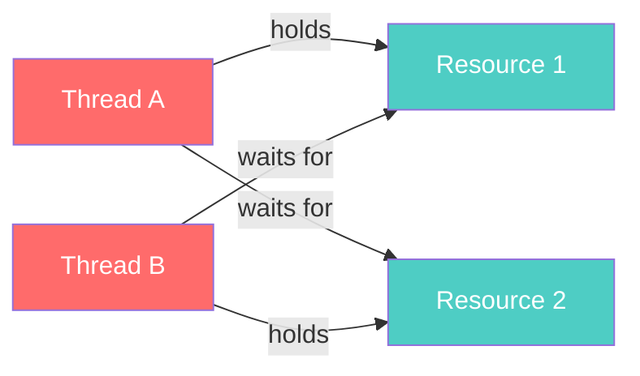

# Deadlocks, Mutex & Semaphores

## Race Conditions

A **race condition** occurs when multiple threads access shared data concurrently, and the outcome depends on execution order.

```typescript
// BROKEN: Race condition
let counter = 0;

// Two threads incrementing simultaneously
// Thread A reads 0, Thread B reads 0
// Thread A writes 1, Thread B writes 1
// Expected: 2, Actual: 1 — LOST UPDATE
```

## Synchronization Primitives

### Mutex (Mutual Exclusion)

A **mutex** is a lock that allows only **one thread** to access a critical section at a time.

```typescript
// Conceptual mutex implementation
class Mutex {
  private locked = false;
  private queue: (() => void)[] = [];

  async acquire(): Promise<void> {
    if (!this.locked) {
      this.locked = true;
      return;
    }
    // Wait until released
    return new Promise<void>((resolve) => {
      this.queue.push(resolve);
    });
  }

  release(): void {
    if (this.queue.length > 0) {
      const next = this.queue.shift()!;
      next(); // wake up next waiter
    } else {
      this.locked = false;
    }
  }
}

// Usage
const mutex = new Mutex();
let sharedCounter = 0;

async function safeIncrement() {
  await mutex.acquire();
  try {
    sharedCounter++; // critical section
  } finally {
    mutex.release();
  }
}
```

### Semaphore

A **semaphore** is a signaling mechanism with a counter, allowing up to **N threads** to access a resource concurrently.

| Type | Count | Use Case |
|---|---|---|
| Binary Semaphore | 0 or 1 | Similar to mutex (but no ownership) |
| Counting Semaphore | 0 to N | Connection pools, rate limiting |

```typescript
class Semaphore {
  private permits: number;
  private queue: (() => void)[] = [];

  constructor(permits: number) {
    this.permits = permits;
  }

  async acquire(): Promise<void> {
    if (this.permits > 0) {
      this.permits--;
      return;
    }
    return new Promise<void>((resolve) => {
      this.queue.push(resolve);
    });
  }

  release(): void {
    if (this.queue.length > 0) {
      const next = this.queue.shift()!;
      next();
    } else {
      this.permits++;
    }
  }
}

// Connection pool with max 5 connections
const pool = new Semaphore(5);

async function queryDB(sql: string) {
  await pool.acquire();
  try {
    // use connection...
    console.log(`Executing: ${sql}`);
  } finally {
    pool.release();
  }
}
```

### Mutex vs Semaphore

| Aspect | Mutex | Semaphore |
|---|---|---|
| Ownership | Only the locker can unlock | Any thread can signal |
| Count | Binary (0/1) | 0 to N |
| Purpose | Mutual exclusion | Resource counting / signaling |
| Priority inheritance | Supported | Not typically |

---

## Deadlocks

A **deadlock** occurs when two or more threads are each waiting for a resource held by another, forming a cycle.

### Four Necessary Conditions (Coffman Conditions)

All four must hold simultaneously for a deadlock:

1. **Mutual Exclusion** — Resources can't be shared
2. **Hold and Wait** — Thread holds one resource while waiting for another
3. **No Preemption** — Resources can't be forcibly taken
4. **Circular Wait** — Circular chain of threads, each waiting for the next



### Prevention Strategies

| Strategy | How | Trade-off |
|---|---|---|
| **Break Mutual Exclusion** | Use lock-free data structures | Complex implementation |
| **Break Hold and Wait** | Acquire all resources atomically | Poor resource utilization |
| **Allow Preemption** | Force release if can't get all | May cause starvation |
| **Break Circular Wait** | Impose global ordering on locks | Requires discipline |

### Resource Ordering (Best Practice)

```typescript
// DEADLOCK PRONE:
// Thread A: lock(mutex1) → lock(mutex2)
// Thread B: lock(mutex2) → lock(mutex1)

// SAFE: Always acquire locks in the same global order
async function transferMoney(
  from: Account,
  to: Account,
  amount: number
) {
  // Order by account ID to prevent deadlock
  const [first, second] = from.id < to.id
    ? [from, to]
    : [to, from];

  await first.mutex.acquire();
  await second.mutex.acquire();
  try {
    from.balance -= amount;
    to.balance += amount;
  } finally {
    second.mutex.release();
    first.mutex.release();
  }
}
```

### Deadlock Detection

```
Banker's Algorithm:
1. Track available resources, max needs, and current allocation
2. Find a thread whose remaining needs can be satisfied
3. Pretend it finishes → release its resources
4. Repeat until all threads finish (safe) or stuck (unsafe)

Wait-For Graph:
1. Build a directed graph: Thread A → Thread B if A waits for B
2. If cycle exists → deadlock detected
3. Recovery: kill a thread or preempt a resource
```

## Classic Concurrency Problems

### Producer-Consumer (Bounded Buffer)

```typescript
class BoundedBuffer<T> {
  private buffer: T[] = [];
  private capacity: number;
  private notFull: Semaphore;
  private notEmpty: Semaphore;
  private mutex = new Mutex();

  constructor(capacity: number) {
    this.capacity = capacity;
    this.notFull = new Semaphore(capacity);
    this.notEmpty = new Semaphore(0);
  }

  async produce(item: T): Promise<void> {
    await this.notFull.acquire();  // wait if full
    await this.mutex.acquire();
    this.buffer.push(item);
    this.mutex.release();
    this.notEmpty.release();       // signal item available
  }

  async consume(): Promise<T> {
    await this.notEmpty.acquire(); // wait if empty
    await this.mutex.acquire();
    const item = this.buffer.shift()!;
    this.mutex.release();
    this.notFull.release();        // signal space available
    return item;
  }
}
```

### Readers-Writers Problem

- Multiple readers can read simultaneously
- Writers need exclusive access
- Variants: reader-priority, writer-priority, fair

### Dining Philosophers

- 5 philosophers, 5 forks (shared between adjacent)
- Solutions: resource ordering, arbitrator, Chandy/Misra
