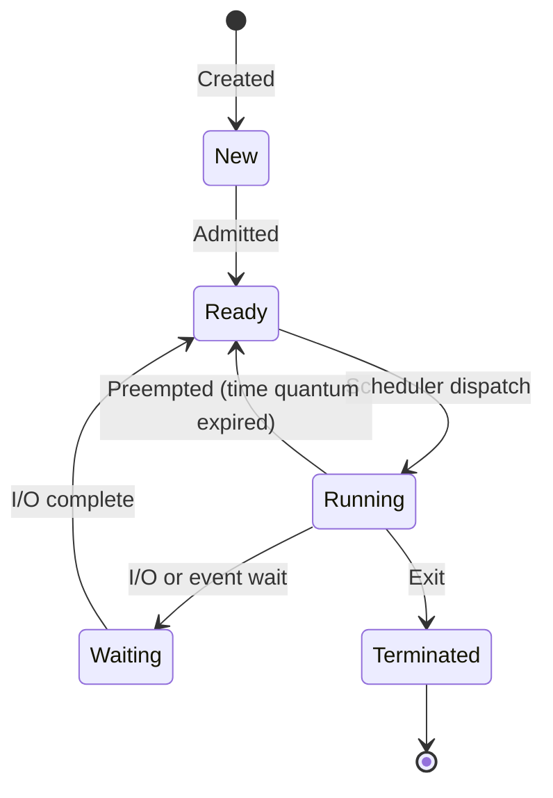

# Processes, Threads & Concurrency

## Process vs Thread

A **process** is an independent program in execution with its own memory space. A **thread** is the smallest unit of execution within a process, sharing the process's memory.

| Aspect | Process | Thread |
|---|---|---|
| Memory | Own address space | Shared within process |
| Creation cost | Heavy (fork, copy-on-write) | Lightweight |
| Communication | IPC (pipes, sockets, shared memory) | Direct memory access |
| Isolation | Full — crash doesn't affect others | Shared — one crash can kill all |
| Context switch cost | High (TLB flush, page table swap) | Low (same address space) |

### Process States



### Context Switching

When the OS switches the CPU from one process/thread to another:

1. Save the state (registers, PC, stack pointer) of the current process
2. Load the state of the next process
3. Flush/update TLB and cache (for process switch)

**Cost:** ~1–10 μs per switch. With thousands of context switches/second, this overhead matters.

## Concurrency vs Parallelism

| Concept | Description | Example |
|---|---|---|
| **Concurrency** | Managing multiple tasks (interleaving) | Single-core OS running multiple apps |
| **Parallelism** | Executing multiple tasks simultaneously | Multi-core CPU, each core runs a thread |

### Concurrency Models

```typescript
// 1. Multi-threading (shared memory)
// Java, C++, Rust — true parallelism on multi-core

// 2. Event loop (single-threaded concurrency)
// Node.js, browser JS — non-blocking I/O
async function fetchAll(urls: string[]) {
  // Concurrent I/O, single thread
  const promises = urls.map(url => fetch(url));
  return Promise.all(promises);
}

// 3. Actor model (message passing)
// Erlang/Elixir — each actor has own state, communicates via messages
// No shared memory → no locks needed

// 4. CSP (Communicating Sequential Processes)
// Go channels — goroutines communicate via typed channels
```

## Scheduling Algorithms

| Algorithm | Type | Description | Pros | Cons |
|---|---|---|---|---|
| FCFS | Non-preemptive | First come, first served | Simple | Convoy effect |
| SJF | Non-preemptive | Shortest job first | Optimal avg wait time | Starvation of long jobs |
| SRTF | Preemptive | Shortest remaining time | Better than SJF | Starvation, overhead |
| Round Robin | Preemptive | Fixed time quantum | Fair | High context switch overhead |
| Priority | Both | Based on priority value | Flexible | Priority inversion |
| CFS (Linux) | Preemptive | Completely Fair Scheduler | Fair, O(log n) via red-black tree | Complex |

### Round Robin Example

```
Time quantum = 4ms
Processes: P1(10ms), P2(4ms), P3(6ms)

Timeline:
[P1: 0-4] → [P2: 4-8] → [P3: 8-12] → [P1: 12-16] → [P3: 16-18] → [P1: 18-20]

P2 finishes at 8ms
P3 finishes at 18ms
P1 finishes at 20ms
Average turnaround = (20 + 8 + 18) / 3 = 15.3ms
```

## Inter-Process Communication (IPC)

| Mechanism | Speed | Complexity | Use Case |
|---|---|---|---|
| **Pipes** | Fast | Simple | Parent-child, unidirectional |
| **Named Pipes (FIFO)** | Fast | Simple | Unrelated processes |
| **Message Queues** | Medium | Medium | Structured messages |
| **Shared Memory** | Fastest | Complex (needs sync) | High-throughput data sharing |
| **Sockets** | Variable | Medium | Network/local communication |
| **Signals** | Fast | Simple | Async notifications (SIGTERM, SIGKILL) |
| **Memory-mapped Files** | Fast | Medium | Large data sharing, persistence |

## Fork & Exec (Unix Process Creation)

```
fork() — Creates a child process (copy of parent)
  ├── Returns 0 in child
  └── Returns child PID in parent

exec() — Replaces current process image with new program
  └── fork() + exec() = spawning a new program

Copy-on-Write (COW):
  └── Pages shared until one process writes → then copied
  └── Makes fork() efficient even for large processes
```

## Practical Considerations

- **I/O-bound tasks** → Use async/event-loop (Node.js) or thread pool
- **CPU-bound tasks** → Use multi-process (worker threads, child processes)
- **In Python** → GIL prevents true thread parallelism; use `multiprocessing`
- **In Go** → Goroutines are lightweight green threads (~4KB stack)
- **In Rust** → Threads with ownership model prevents data races at compile time
