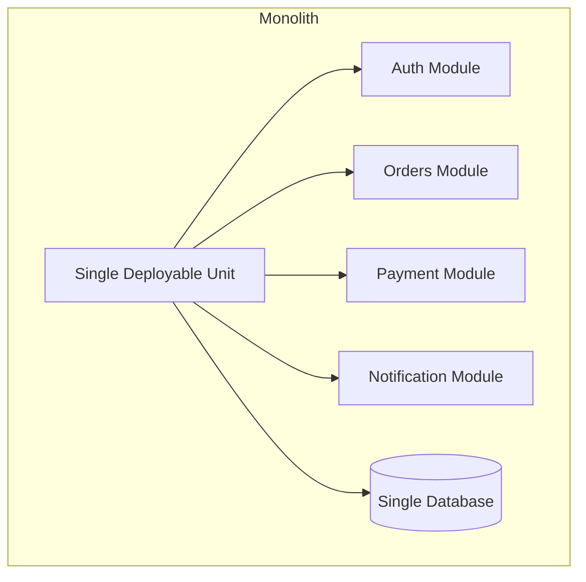
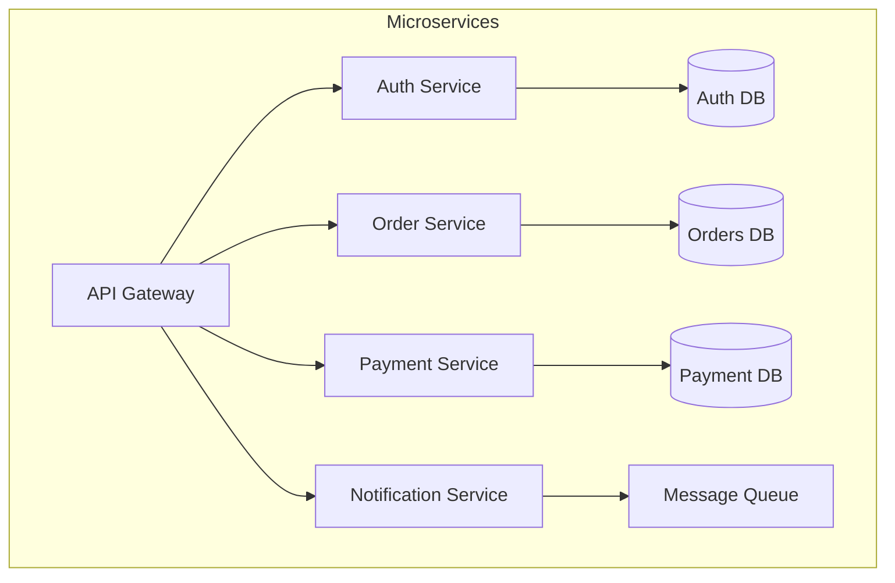

# Microservices, Load Balancing & Caching

## Monolith vs Microservices





| Aspect | Monolith | Microservices |
|---|---|---|
| Deployment | All-or-nothing | Independent per service |
| Scaling | Entire application | Per-service (scale what's hot) |
| Tech stack | Uniform | Polyglot (best tool per service) |
| Data consistency | ACID transactions | Eventual consistency (sagas) |
| Complexity | Simple initially | Distributed systems complexity |
| Team structure | Single team | Conway's Law — team per service |

### When to Choose

- **Start with a monolith** — Split when you hit scaling/team boundaries
- **Microservices for**: Large teams, independent scaling needs, different reliability requirements per component
- **Avoid microservices if**: Small team, simple domain, don't need independent deployment

---

## Load Balancing

Distributes incoming traffic across multiple servers to ensure no single server becomes a bottleneck.

### Load Balancing Strategies

| Algorithm | Description | Best For |
|---|---|---|
| **Round Robin** | Rotate through servers sequentially | Uniform servers, stateless |
| **Weighted Round Robin** | Servers get traffic proportional to weight | Heterogeneous servers |
| **Least Connections** | Route to server with fewest active connections | Variable request duration |
| **IP Hash** | Hash client IP → consistent server | Session affinity |
| **Consistent Hashing** | Minimal redistribution when servers change | Distributed caches |
| **Random** | Pick a random server | Simple, surprisingly effective |

### L4 vs L7 Load Balancing

| Layer | Operates On | Pros | Cons |
|---|---|---|---|
| L4 (Transport) | TCP/UDP packets | Fast, protocol-agnostic | Can't route by content |
| L7 (Application) | HTTP headers, URLs, cookies | Content-based routing, SSL termination | Slower, more resource-intensive |

### Health Checks

```
Active Health Check:
  LB periodically pings /health endpoint
  → Remove unhealthy servers from pool
  → Re-add when they recover

Passive Health Check:
  LB monitors response codes/latency
  → Mark server as unhealthy after N failures
```

---

## Caching

Store frequently accessed data closer to the consumer to reduce latency and database load.

### Cache Levels

```
Client (Browser Cache) → CDN → API Gateway Cache → Application Cache → Database Cache
       ~0ms              ~5ms      ~10ms              ~1ms              ~0.1ms
                                                    (Redis/Memcached)   (query cache)
```

### Caching Strategies

| Strategy | Read | Write | Consistency | Use Case |
|---|---|---|---|---|
| **Cache-Aside** | App checks cache → miss → read DB → populate cache | App writes to DB, invalidates cache | Eventually consistent | Most common, general purpose |
| **Read-Through** | Cache handles DB reads transparently | N/A | Consistent reads | ORM-level caching |
| **Write-Through** | N/A | Write to cache AND DB synchronously | Strong consistency | When consistency > latency |
| **Write-Behind** | N/A | Write to cache, async flush to DB | Eventually consistent | High write throughput |
| **Write-Around** | Cache-aside reads | Write directly to DB, bypass cache | Cache misses on recent writes | Write-heavy, infrequent reads |

### Cache-Aside Pattern (Most Common)

```typescript
class UserService {
  private cache: RedisClient;
  private db: Database;

  async getUser(id: string): Promise<User> {
    // 1. Check cache
    const cached = await this.cache.get(`user:${id}`);
    if (cached) return JSON.parse(cached);

    // 2. Cache miss → read from DB
    const user = await this.db.query("SELECT * FROM users WHERE id = $1", [id]);

    // 3. Populate cache with TTL
    await this.cache.set(`user:${id}`, JSON.stringify(user), "EX", 3600);

    return user;
  }

  async updateUser(id: string, data: Partial<User>): Promise<void> {
    // Write to DB
    await this.db.query("UPDATE users SET ... WHERE id = $1", [id]);

    // Invalidate cache (don't update — avoids race conditions)
    await this.cache.del(`user:${id}`);
  }
}
```

### Cache Eviction Policies

| Policy | Description | When to Use |
|---|---|---|
| **LRU** | Evict least recently used | General purpose (most common) |
| **LFU** | Evict least frequently used | Stable access patterns |
| **FIFO** | Evict oldest entry | Simple, temporal data |
| **TTL** | Expire after time duration | Session data, tokens |
| **Random** | Evict random entry | When no clear pattern |

### Cache Problems

| Problem | Description | Solution |
|---|---|---|
| **Cache Stampede** | Many requests miss cache simultaneously → DB overload | Locking (single flight), pre-warming |
| **Cache Penetration** | Queries for non-existent keys always miss | Bloom filter, cache null results |
| **Cache Avalanche** | Many keys expire simultaneously | Staggered TTLs, circuit breaker |
| **Stale Data** | Cache contains outdated data | TTL, event-driven invalidation |

---

## CDN (Content Delivery Network)

Caches static content at **edge locations** geographically close to users.

### How It Works

```
User in Tokyo → CDN Edge (Tokyo) → [Cache HIT: serve directly, ~5ms]
                                  → [Cache MISS: fetch from origin in US, cache, ~200ms]
```

### What to Cache on CDN
- Static assets (JS, CSS, images, fonts)
- API responses with `Cache-Control` headers
- Pre-rendered HTML pages
- Video/audio content

### CDN Cache Headers

```http
Cache-Control: public, max-age=31536000, immutable
# ↑ Cache for 1 year, never revalidate (use for fingerprinted assets)

Cache-Control: public, max-age=0, must-revalidate
# ↑ Always revalidate with origin (use for HTML pages)

ETag: "abc123"
# ↑ Fingerprint for conditional requests (304 Not Modified)
```
