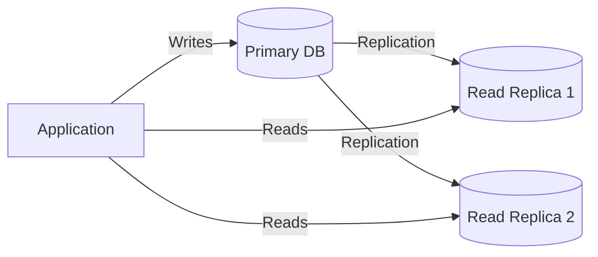
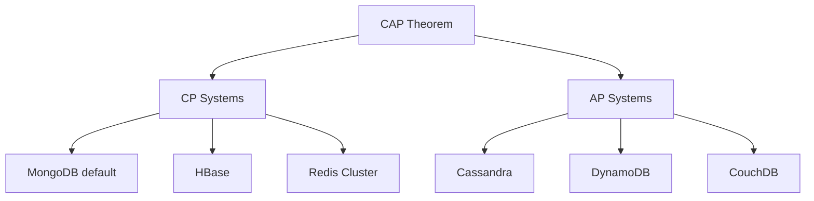
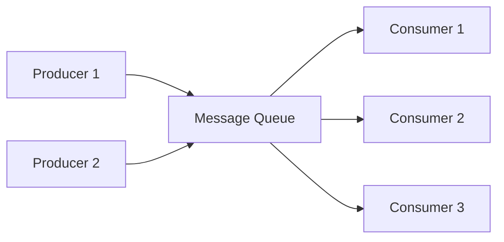

# Database Sharding, CAP Theorem & Message Queues

## Database Scaling Strategies

### Vertical Scaling (Scale Up)
- Bigger machine: more CPU, RAM, faster SSD
- **Limit:** Single machine has a ceiling
- **Use when:** Simple, not yet at scale

### Horizontal Scaling (Scale Out)
- More machines sharing the load
- Requires **replication** and/or **sharding**

### Read Replicas



- **Use when:** Read-heavy workload (90%+ reads)
- **Trade-off:** Replication lag → eventual consistency for reads

---

## Database Sharding

Sharding **partitions data horizontally** across multiple databases. Each shard holds a subset of the data.

### Sharding Strategies

| Strategy | Description | Pros | Cons |
|---|---|---|---|
| **Range-based** | Shard by value ranges (e.g., user ID 1–1M, 1M–2M) | Simple, range queries easy | Hot spots if distribution uneven |
| **Hash-based** | Hash(key) mod N → shard number | Even distribution | Range queries require scatter-gather |
| **Directory-based** | Lookup table maps keys → shards | Flexible | Lookup table = single point of failure |
| **Geographic** | Shard by region/location | Data locality, compliance | Cross-region queries are complex |

### Consistent Hashing

Minimizes data redistribution when servers are added/removed.

```
Hash ring: 0 ─────────────────── 2^32
           │                      │
   Server A(100)  Server B(500)  Server C(800)
           │         │             │
   Keys 0-100    101-500       501-800

Adding Server D(300):
  Only keys 101-300 move from B to D
  (instead of rehashing everything)
```

### Sharding Challenges

| Challenge | Description | Mitigation |
|---|---|---|
| **Cross-shard joins** | Data on different shards can't be joined easily | Denormalize, application-level joins |
| **Distributed transactions** | ACID across shards is hard | Saga pattern, eventual consistency |
| **Rebalancing** | Adding/removing shards requires data migration | Consistent hashing, virtual shards |
| **Hot shards** | Uneven data/traffic distribution | Better shard key, splitting hot shards |
| **Operational complexity** | Each shard needs backup, monitoring, etc. | Managed databases (Aurora, Spanner) |

---

## CAP Theorem

In a distributed system, you can guarantee at most **two of three** properties:

| Property | Meaning |
|---|---|
| **Consistency (C)** | Every read receives the most recent write |
| **Availability (A)** | Every request receives a response (even if stale) |
| **Partition Tolerance (P)** | System works despite network partitions between nodes |

### The Real Choice: CP or AP

Since network partitions **will** happen in any distributed system, you really choose between **C** and **A** during a partition:



| System | Choice | Behavior During Partition |
|---|---|---|
| **CP** (Consistency + Partition Tolerance) | Refuse requests if can't guarantee consistency | Bank transfers, inventory |
| **AP** (Availability + Partition Tolerance) | Serve requests with potentially stale data | Social media feeds, DNS |

### PACELC Extension

| During Partition | Else (no partition) |
|---|---|
| Choose C or A | Choose L(atency) or C(onsistency) |

Example: DynamoDB is PA/EL — Available during partitions, Low latency normally.

---

## Message Queues

Decouple producers from consumers, enabling asynchronous processing, buffering, and fault tolerance.

### Core Concepts



### Queue vs Topic (Pub/Sub)

| Model | Delivery | Use Case |
|---|---|---|
| **Queue** | One consumer processes each message | Task distribution, work queues |
| **Topic (Pub/Sub)** | All subscribers receive every message | Event broadcasting, notifications |

### Message Queue Technologies

| Technology | Model | Ordering | Throughput | Use Case |
|---|---|---|---|---|
| **RabbitMQ** | Queue + Pub/Sub | Per-queue FIFO | Medium | Task queues, RPC |
| **Apache Kafka** | Log-based topics | Per-partition | Very high | Event streaming, logs |
| **Amazon SQS** | Queue | Best-effort (FIFO available) | High | Serverless, decoupling |
| **Redis Streams** | Log-based | Per-stream | High | Real-time, lightweight |

### Kafka Architecture

```
Topic: "order-events"
├── Partition 0: [msg1, msg4, msg7, ...] → Consumer A
├── Partition 1: [msg2, msg5, msg8, ...] → Consumer B
└── Partition 2: [msg3, msg6, msg9, ...] → Consumer C

Key concepts:
- Messages are immutable, append-only
- Retention-based (not deletion on consume)
- Consumer groups for parallel processing
- Offset tracking per consumer group
```

### Message Delivery Guarantees

| Guarantee | Description | Implementation |
|---|---|---|
| **At-most-once** | Fire and forget; may lose messages | No acks |
| **At-least-once** | Retry until acknowledged; may duplicate | Ack + retry |
| **Exactly-once** | Each message processed exactly once | Idempotency + transactions |

### Common Patterns

| Pattern | Description |
|---|---|
| **Work Queue** | Distribute tasks across workers |
| **Event Sourcing** | Store events as source of truth, rebuild state |
| **CQRS** | Separate read/write models, sync via events |
| **Saga** | Distributed transactions via compensating events |
| **Dead Letter Queue** | Failed messages go to a separate queue for debugging |

## System Design Checklist

When designing any distributed system, consider:

1. **Requirements** — Functional & non-functional (latency, throughput, consistency)
2. **Estimation** — QPS, storage, bandwidth
3. **API Design** — RESTful endpoints, gRPC for internal
4. **Data Model** — SQL vs NoSQL, schema design
5. **High-Level Design** — Components and data flow
6. **Scaling** — Caching, sharding, replication
7. **Monitoring** — Metrics, alerting, logging
8. **Failure Modes** — What happens when X fails?
